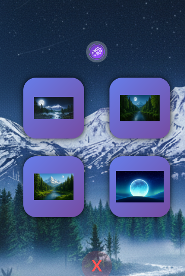
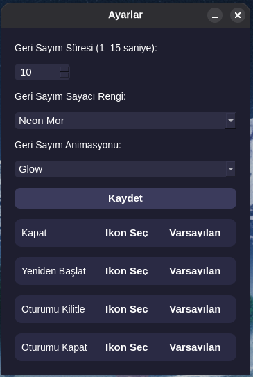
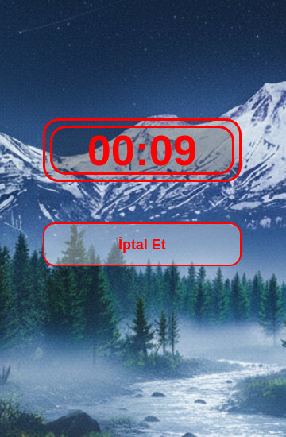
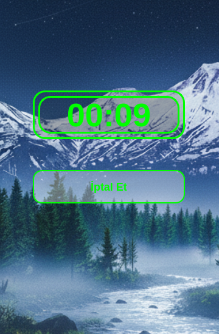

# Power Menu

Bu projeye ait ekran görüntüleri:
![Uygulamamenu] !(uygulamamenu.png)

  

Linux masaüstü ortamları için geliştirilmiş basit ve hızlı bir güç yönetimi aracıdır. Uygulama; sistemi kapatma, yeniden başlatma, oturum kilitleme, oturumu kapatma gibi temel güç seçeneklerini tek bir pencerede toplar.

Uygulama ÖZellikleri 

PyQt5 tabanlı modern ve şık bir güç menüsü arayüzü.

Kapatma, yeniden başlatma, oturumu kapatma ve kilitleme seçenekleri.

Tamamen özelleştirilmiş, frameless ve yarı saydam pencere tasarımı.

Büyük ikonlu güç butonları ve animasyonlu hover efektleri.

Buton üzerine gelindiğinde açıklama etiketi görüntüleme.

Uygulama içinden açılabilen gelişmiş ayarlar penceresi.

Geri sayım süresi ayarlanabilir (1–15 saniye).

Geri sayım rengi seçilebilir (Neon renk seti).

Geri sayım animasyonu seçilebilir (Glow, Pulse, Zoom, ColorShift).

Her işlem için özel ikon seçme veya varsayılana dönme desteği.

Kullanıcı ayarlarını ~/.config/power-menu.conf altında saklama.

Özel ikonları ~/.config/power-menu-icons.json içinde saklama.

İşlem seçildiğinde otomatik geri sayım yapan onay penceresi.

Geri sayım süresi bittiğinde otomatik onay / istenirse iptal butonu.

İkon değişikliklerinde arayüzün canlı olarak yenilenmesi.

Animasyonlar için QTimer ve QPropertyAnimation kullanımı.
