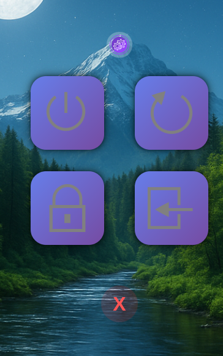
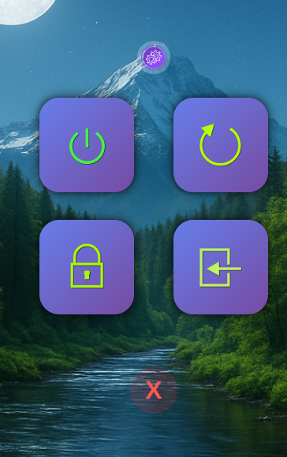
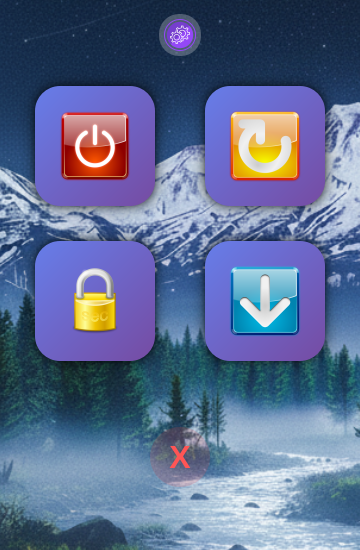
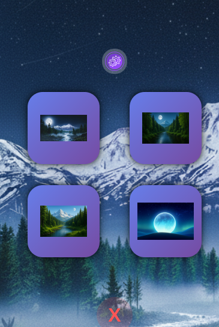
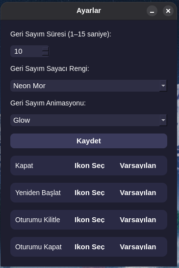
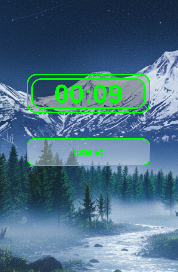

# Gnome Hızlı Güç Menüsü

Bu projeye ait ekran görüntüleri:

Pardus Gnome 25 için geliştirilmiş güç yönetimi aracıdır. Uygulama; sistemi kapatma, yeniden başlatma, oturum kilitleme, oturumu kapatma gibi temel güç seçeneklerini tek bir pencerede toplar.

                                               ### **Uygulamanın Test Edildiği Ortam** 
       **Pardus Gnome 25 (Wayland ve x11)**   Sorunsuz Çalışıyor
    **Pardus 25  KDE Masaüstü Ortamı**
              Pardus 25  KDE (sddm)  ------- Sorunsuz   Çalışıyor    Pardus 25 KDE (gdm3)  ---------  Sorunsuz Çalışıyor
              Pardus 25 Gnome (sddm) ----  Sorunsuz Çalışıyor      Pardus 25 Gnome (gdm3)-------  Sorunsuz Çalışıyor
    **Pardus Cinnamon Masaüstü Ortamı** ----- Sorunsuz Çalışıyor 

KDE bu sürümde denemiştir

KDE Plasma sürümü: 6.3.6

KDE Frameworks sürümü: 6.13.0

Qt sürümü: 6.8.2

### Uygulamanın istediği bağımlılıklar Python 3- PyQt5

Bağımlılık Kurulumu : (Terminale yazılacak) sudo apt install python3-pyqt5 -y   

------------------------------------------------------------------------------------------------------------------------------

Kurulum

oturum-paket.deb paketini çift tıklayıp kurulum yapabilirsiniz .

------------------------------------------------------------------------------------------------------------------------------

Terminalden Kurulum .

oturum-paket.deb paketi Masaüstünüzde olsun .

cd ~/Masaüstü

sudo dpkg -i oturum-paket.deb

------------------------------------------------------------------------------------------------------------------------------

Uygulama ÖZellikleri 

PyQt5 tabanlı modern ve şık bir güç menüsü arayüzü.

Kapatma, yeniden başlatma, oturumu kapatma ve kilitleme seçenekleri.

Her işlem için özel ikon seçme veya varsayılana dönme desteği.

Tamamen özelleştirilmiş, frameless ve yarı saydam pencere tasarımı.

Büyük ikonlu güç butonları ve animasyonlu hover efektleri.

Buton üzerine gelindiğinde açıklama etiketi görüntüleme.

Uygulama içinden açılabilen gelişmiş ayarlar penceresi.

Geri sayım süresi ayarlanabilir (1–15 saniye).

Geri sayım rengi seçilebilir (Neon renk seti).

Geri sayım animasyonu seçilebilir (Glow, Pulse, Zoom, ColorShift).

Kullanıcı ayarlarını ~/.config/power-menu.conf altında saklama.

Özel ikonları ~/.config/power-menu-icons.json içinde saklama.

İşlem seçildiğinde otomatik geri sayım yapan onay penceresi.

Geri sayım süresi bittiğinde otomatik onay / istenirse iptal butonu.

İkon değişikliklerinde arayüzün canlı olarak yenilenmesi.

Animasyonlar için QTimer ve QPropertyAnimation kullanımı.
